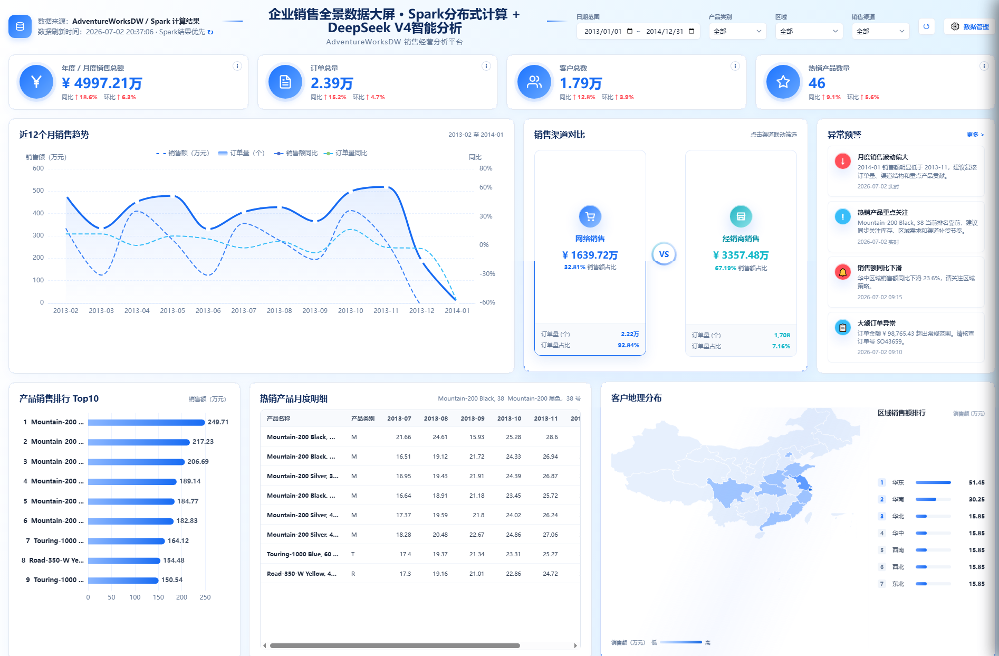
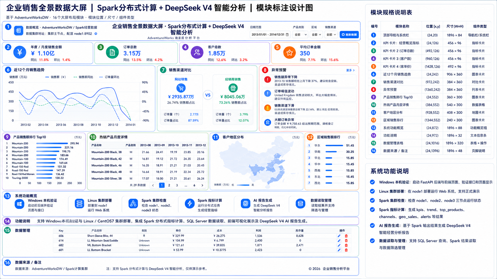
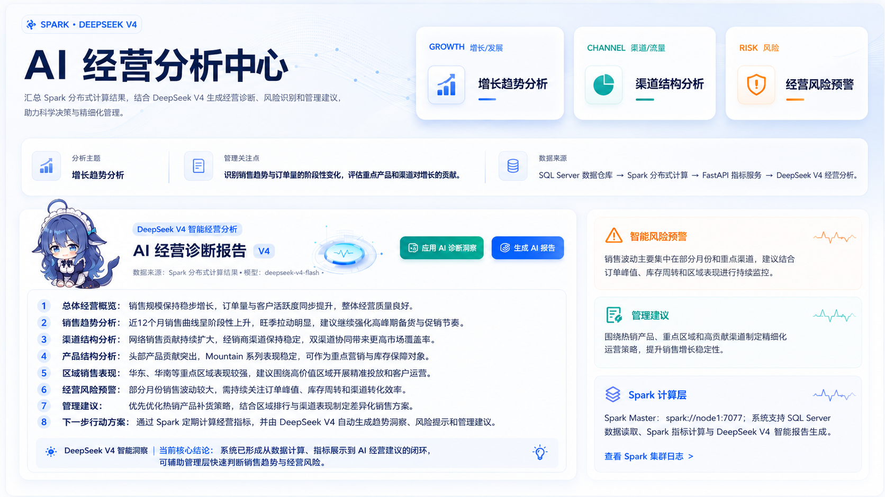
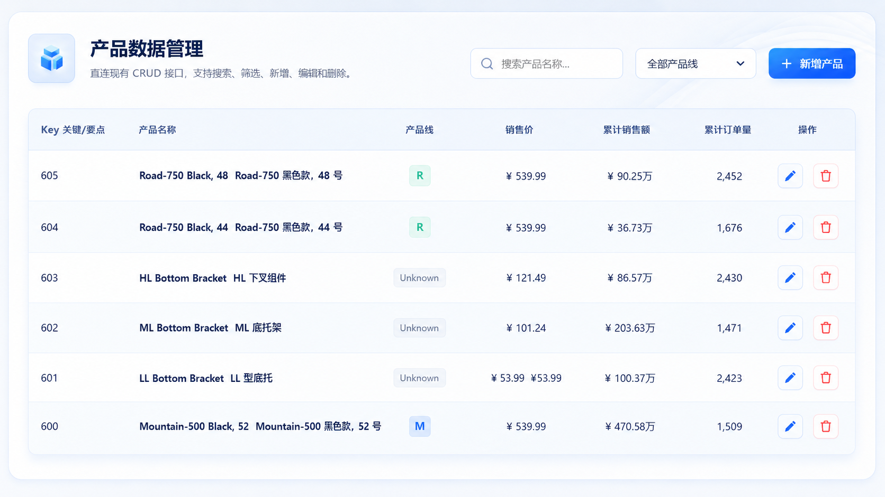

# Spark AI 企业销售决策系统

基于 **SQL Server / AdventureWorksDW + Spark Standalone + FastAPI + ECharts + DeepSeek V4** 构建的企业销售经营决策系统。



本项目不是传统意义上的销售图表大屏，而是一套将 **分布式指标计算、经营可视化、AI 诊断报告、产品数据管理** 结合在一起的企业级销售分析平台。系统通过 Spark 将销售明细数据加工为经营指标，通过 DeepSeek V4 将指标转化为风险判断和管理建议，最终帮助用户完成从“看数据”到“做决策”的闭环。

## 1. 项目核心定位

传统销售 BI 通常采用“后端查询数据库、前端展示图表”的方式，主要解决“数据看见”的问题。本系统进一步引入 Spark 和 DeepSeek V4，将系统升级为：

```text
SQL Server 数据仓库
        ↓
Spark 分布式指标计算引擎
        ↓
FastAPI 指标服务层
        ↓
ECharts 可视化决策大屏
        ↓
DeepSeek V4 智能经营诊断
```

系统重点能力：

- 使用 Spark 三节点集群计算销售经营指标。
- 使用 FastAPI 提供统一 REST 接口。
- 使用 ECharts 构建销售可视化驾驶舱。
- 使用 DeepSeek V4 生成智能经营诊断报告。
- 支持产品数据搜索、新增、编辑、删除等管理操作。
- 支持 Linux / CentOS7 部署运行，适合课程设计、项目答辩和企业数据分析演示。

## 2. 系统功能介绍

### 2.0 系统产品设计图




### 2.1 销售经营总览

系统首页展示销售总额、订单量、客户数、产品数、客单价等核心 KPI。用户进入系统后可以快速判断当前销售规模和整体经营状态。

数据来源于 Spark 计算后的 `kpis.json`，前端不需要每次重新执行复杂 SQL 聚合。

### 2.2 销售趋势分析

系统按月份展示销售额和订单量变化，帮助用户识别销售增长、回落和波动周期。

对应 Spark 输出：

```text
output/spark_result/trend.json
```

### 2.3 渠道结构分析

系统对 Internet 和 Reseller 两类销售渠道进行对比，展示渠道销售额、订单量、占比和客单价。

该模块用于判断企业是否存在单一渠道依赖、渠道结构是否健康、不同渠道贡献是否均衡。

### 2.4 产品贡献分析

系统展示 Top 产品销售排行，识别高贡献产品和头部产品依赖风险。

用户可以通过产品排行快速发现核心产品，也可以结合产品管理模块对产品信息进行维护。

### 2.5 区域销售分析

系统从国家、地区、城市等维度分析销售表现，帮助用户判断核心市场和潜力区域。

该模块适合展示企业销售地域分布和市场资源分配依据。

### 2.6 产品数据管理

系统提供产品数据管理功能，支持：

- 产品搜索
- 产品线筛选
- 新增产品
- 编辑产品
- 删除产品
- 本地 SQLite 覆盖管理

该模块让系统不只是“只读大屏”，也具备基础业务数据维护能力。

### 2.7 Spark 计算层状态

前端展示 Spark 计算结果状态，让用户知道当前数据来自 Spark 计算结果还是 SQL Server 兜底查询。

该设计用于突出系统的数据链路，让分布式计算能力在页面上可感知。

### 2.8 DeepSeek V4 智能经营诊断



DeepSeek V4 是本系统智能分析能力的核心。它接收 Spark 计算出的 KPI、趋势、渠道、产品、区域和异常预警数据，生成面向管理层的经营诊断报告。

AI 报告内容包括：

- 总体经营概览
- 销售趋势判断
- 渠道结构分析
- 产品贡献分析
- 区域销售表现
- 经营风险预警
- 管理建议
- 下一步行动方向

## 3. DeepSeek V4 的重要性

在传统销售大屏中，图表只能告诉用户“发生了什么”，例如销售额下降、某个产品排名靠前、某个渠道占比过高。但这些信息仍然需要人工解释。

DeepSeek V4 在本实时系统中的作用是把 Spark 计算结果转化为经营语言，使系统具备“解释数据”和“辅助决策”的能力。

### 3.1 DeepSeek V4 不是普通聊天模块

本项目中的 DeepSeek V4 不是简单问答，而是一个经营诊断引擎。它的输入不是随意文本，而是 Spark 统一计算后的结构化经营指标。

输入数据包括：

```text
KPI 总览
销售趋势
渠道表现
产品排行
区域销售
异常预警
```

输出内容是面向企业管理场景的销售经营报告。

### 3.2 为什么必须先有 Spark，再有 DeepSeek V4

DeepSeek V4 的分析质量依赖输入数据质量。Spark 负责先把 SQL Server 中的销售明细数据加工成统一、稳定、可复用的指标结果，再交给 DeepSeek V4 分析。

如果没有 Spark，AI 可能只能面对零散查询结果，分析口径不稳定；有了 Spark 后，AI 报告基于统一指标生成，结论更一致、更适合展示。

### 3.3 DeepSeek V4 带来的系统提升

- 将图表数据转化为经营判断。
- 将指标异常转化为风险提醒。
- 将产品、渠道、区域数据转化为管理建议。
- 降低人工解读大屏的成本。
- 让系统从“可视化展示”升级为“智能决策辅助”。

## 4. Spark 分布式指标计算引擎

Spark 在本系统中承担 **分布式指标计算引擎** 的角色。它不是简单的数据处理脚本，而是位于 SQL Server 和 FastAPI 之间的核心计算层。

### 4.1 Spark 运行链路

```text
SQL Server 销售明细数据
        ↓
PySpark JDBC 读取事实表和维度表
        ↓
构建统一销售宽表
        ↓
Spark Worker 并行聚合计算
        ↓
输出 JSON 指标结果
        ↓
FastAPI 读取并提供接口
        ↓
前端大屏与 DeepSeek V4 使用
```

### 4.2 三节点分布式架构

推荐部署结构：

```text
node1：Spark Master + Worker + Web 服务部署节点
node2：Spark Worker
node3：Spark Worker
```

node1 负责 Spark 任务调度和资源管理，node2、node3 参与分区计算。销售指标计算任务提交到：

```text
spark://node1:7077
```

### 4.3 PySpark 设计

核心代码位于：

```text
backend/spark_jobs/sales_spark_job.py
```

主要设计包括：

```text
SparkSession 创建
SQL Server JDBC 数据读取
Internet 与 Reseller 销售事实统一
日期、产品、客户、区域维度关联
KPI、趋势、渠道、产品、区域指标计算
异常预警规则计算
JSON 指标结果输出
```

核心函数：

| 函数 | 作用 |
| --- | --- |
| `build_unified_sales` | 统一 Internet 与 Reseller 销售事实 |
| `add_dimensions` | 关联日期、产品、客户、地理维度 |
| `compute_kpis` | 计算 KPI 总览 |
| `compute_trend` | 计算月度销售趋势 |
| `compute_channels` | 计算渠道结构 |
| `compute_top_products` | 计算 Top 产品排行 |
| `compute_geo` | 计算区域销售表现 |
| `compute_alerts` | 计算经营异常预警 |

### 4.4 相比非分布式系统的提升

| 对比项 | 普通非分布式大屏 | 本系统 Spark 方案 |
| --- | --- | --- |
| 指标计算位置 | SQL Server 或 Web 后端实时查询 | Spark 集群统一预计算 |
| 计算资源 | 单机数据库或单个后端进程 | node1、node2、node3 多节点并行 |
| 前端刷新压力 | 每次刷新可能触发复杂 SQL | 读取 Spark 生成的 JSON 指标 |
| 扩展方式 | 优化 SQL 或提升单机配置 | 增加 Spark Worker 节点 |
| 指标口径 | 容易分散在多个接口中 | Spark 统一计算并沉淀 |
| AI 输入 | 可能依赖零散查询结果 | 使用统一 Spark 指标作为输入 |

## 5. 技术架构

```text
浏览器 / 前端大屏
  └─ frontend/index.html
     ├─ ECharts 图表
     ├─ KPI 卡片
     ├─ 产品管理表格
     ├─ Spark 计算状态
     └─ DeepSeek V4 报告展示

FastAPI 服务层
  └─ backend/app.py
     ├─ 经营分析接口
     ├─ 产品 CRUD 接口
     ├─ Spark 结果读取接口
     └─ DeepSeek V4 报告接口

Spark 计算层
  └─ backend/spark_jobs/
     ├─ SQL Server JDBC 读取
     ├─ 销售宽表构建
     ├─ 指标分布式计算
     └─ JSON 结果输出

AI 分析层
  └─ backend/ai/
     ├─ DeepSeek V4 API 调用
     ├─ Prompt 模板
     └─ 经营报告生成

数据层
  ├─ SQL Server / AdventureWorksDW
  └─ SQLite 产品管理本地库
```

## 6. 项目目录结构

```text
sales_panorama_dashboard/
  backend/
    app.py                         FastAPI 接口入口
    db.py                          SQL Server 连接
    queries.py                     SQL Server 兜底查询
    local_db.py                    SQLite 产品管理库
    spark_jobs/
      spark_config.py              Spark 配置
      sqlserver_reader.py          SQL Server JDBC 读取
      sales_spark_job.py           Spark 指标计算任务
    ai/
      deepseek_v4_report.py        DeepSeek V4 报告生成
      prompt_templates.py          Prompt 模板
    services/
      spark_result_service.py      Spark 结果读取
      ai_report_service.py         AI 报告服务
  frontend/
    index.html                     前端大屏页面
  output/
    spark_result/                  Spark 指标结果输出目录
  scripts/
    start.sh                       Linux 一键启动
    stop.sh                        Linux 停止服务
    run_spark_job.sh               提交 Spark 任务
    generate_ai_report.sh          生成 DeepSeek V4 报告
    check_spark_cluster.sh         检查 Spark 集群
  docs/                            项目文档和 PPT 大纲
  run.py                           本地服务启动入口
  README.md                        项目说明
```

## 7. Spark、分布式与 DeepSeek V4 核心设计

本节介绍系统的核心实现思想。具体 Linux 上传、解压、启动步骤已单独整理到：

```text
docs/linux_github_deploy_guide.md
```

项目演示 PPT 页面：

```text
docs/ppt.html
```

### 7.1 Spark 代码设计

Spark 相关代码位于：

```text
backend/spark_jobs/
```

核心文件包括：

| 文件 | 作用 |
| --- | --- |
| `spark_config.py` | 统一维护 Spark Master、应用名称、结果目录和 JDBC 配置 |
| `sqlserver_reader.py` | 通过 JDBC 从 SQL Server / AdventureWorksDW 读取事实表和维度表 |
| `sales_spark_job.py` | 执行销售指标分布式计算并输出 JSON 结果 |

`sales_spark_job.py` 是 Spark 指标计算主任务，内部按业务指标拆分为多个函数：

| 函数 | 计算内容 |
| --- | --- |
| `build_unified_sales` | 合并 Internet 与 Reseller 销售事实，统一销售字段 |
| `add_dimensions` | 关联日期、产品、客户、区域维度，构建销售宽表 |
| `compute_kpis` | 计算销售额、订单量、客户数、产品数、客单价 |
| `compute_trend` | 计算月度销售趋势 |
| `compute_channels` | 计算渠道销售额、订单量、占比和客单价 |
| `compute_top_products` | 计算 Top 产品销售排行 |
| `compute_geo` | 计算国家、地区、城市销售表现 |
| `compute_alerts` | 计算销售回落、渠道依赖、产品集中等经营风险 |

整体计算流程：

```text
SQL Server 表
        ↓
Spark JDBC 读取
        ↓
Internet / Reseller 销售事实统一
        ↓
关联日期、产品、客户、区域维度
        ↓
DataFrame 分布式聚合计算
        ↓
输出 kpis / trend / channels / products / geo / alerts JSON
```

### 7.2 系统运行时 Spark 的作用

Spark 在系统中不是展示层，也不是后端接口层，而是位于 SQL Server 和 FastAPI 之间的 **分布式指标计算引擎**。

系统运行时，Spark 负责提前完成复杂经营指标计算，FastAPI 只负责读取计算结果并向前端提供接口。

```text
SQL Server 明细数据
        ↓
Spark 分布式指标计算
        ↓
output/spark_result/*.json
        ↓
FastAPI 指标服务
        ↓
ECharts 前端大屏
        ↓
DeepSeek V4 经营诊断
```

这样设计后，前端页面刷新时不需要反复触发复杂 SQL 聚合，而是读取 Spark 已经沉淀好的指标结果。

### 7.3 本系统的分布式体现

系统采用 Spark Standalone 三节点模式：

```text
node1：Spark Master + Worker
node2：Spark Worker
node3：Spark Worker
```

node1 负责接收任务、管理资源和调度 Executor；node2、node3 作为 Worker 节点参与实际计算。销售明细数据会被划分为多个 Partition，不同 Worker 上的 Executor 并行处理这些 Partition，最终汇总为统一指标结果。

分布式能力主要体现在：

- Spark 任务提交到 `spark://node1:7077`，不是本地 `local[*]` 模式。
- node1、node2、node3 都可以参与销售指标计算。
- KPI、趋势、渠道、产品、区域等指标通过 Spark DataFrame 并行聚合。
- 数据量增加时，可以通过增加 Worker 节点扩展计算能力。
- 前端和 AI 共享 Spark 输出结果，避免多个接口重复计算。

相比非分布式系统，本项目的提升如下：

| 对比项 | 非分布式销售大屏 | 本系统 |
| --- | --- | --- |
| 计算位置 | 后端接口或数据库实时聚合 | Spark 集群统一计算 |
| 计算资源 | 单机数据库 / 单个 Web 服务 | node1、node2、node3 多节点 |
| 页面响应 | 复杂查询会拖慢接口 | 读取 Spark JSON 结果 |
| 指标口径 | 容易分散在多个 SQL 中 | Spark 统一沉淀指标 |
| 扩展能力 | 主要依赖单机性能 | 可横向增加 Worker |
| AI 输入 | 零散查询结果 | 结构化 Spark 指标 |

### 7.4 DeepSeek V4 在系统中的作用

DeepSeek V4 是系统的智能经营诊断层。它不直接替代 Spark，也不直接查询数据库，而是读取 Spark 计算后的结构化指标。

DeepSeek V4 的输入包括：

```text
KPI 总览
销售趋势
渠道结构
产品排行
区域销售
异常预警
```

DeepSeek V4 的输出包括：

```text
总体经营概览
销售趋势判断
渠道结构分析
产品贡献分析
区域销售判断
经营风险预警
管理建议
下一步行动方向
```

它的价值在于把图表和指标转换成管理层可以直接理解的经营语言。传统销售大屏只告诉用户“发生了什么”，DeepSeek V4 能进一步解释“为什么值得关注”和“下一步应该怎么做”。

### 7.5 Spark 与 DeepSeek V4 的组合价值

Spark 和 DeepSeek V4 在系统中是上下游关系：

```text
Spark 负责算得准
DeepSeek V4 负责解释得清楚
```

Spark 先对销售明细进行统一口径的分布式计算，DeepSeek V4 再基于这些指标生成经营诊断。这样可以避免 AI 直接面对零散数据导致口径不一致，也能避免传统 BI 只展示图表、不提供分析结论的问题。

最终系统形成：

```text
数据事实 → 分布式指标计算 → 可视化呈现 → AI 经营诊断 → 管理建议
```

## 8. 实机操作流程

### 8.1 打开系统首页

浏览器访问：

```text
http://node1:8088/index.html
```

用户进入后可以看到 Spark AI 企业销售决策系统首页。页面采用蓝白科技风和网格背景，整体视觉偏企业级经营驾驶舱，适合大屏展示。

### 8.2 查看销售总览

首页 KPI 区展示销售总额、订单量、客户数、产品数量、客单价等指标。用户无需写 SQL，即可看到 Spark 计算后的经营结果。

### 8.3 查看趋势、渠道、产品和区域

用户可以在同一页面查看：

- 月度销售趋势
- Internet / Reseller 渠道结构
- Top 产品排行
- 区域销售表现
- 异常预警

这些图表对应 Spark 输出的结构化指标文件，前端通过 FastAPI 统一读取。

### 8.4 管理产品数据



产品数据管理区支持搜索、筛选、新增、编辑、删除，适合演示系统不仅能展示分析结果，也能进行基础业务数据维护。

### 8.5 生成 AI 经营报告

点击页面中的“生成 AI 报告”，系统会调用：

```text
POST /api/ai/report/generate
```

DeepSeek V4 根据 Spark 指标生成经营诊断报告，并展示在 AI 经营分析中心。

### 8.6 推荐演示顺序

```text
1. 打开首页，展示整体视觉和系统标题
2. 展示 KPI 总览，说明销售经营规模
3. 展示趋势图，说明销售变化
4. 展示渠道图，说明 Internet / Reseller 结构
5. 展示产品排行和区域分析
6. 展示 Spark 计算层状态
7. 点击生成 AI 报告
8. 展示 DeepSeek V4 给出的经营诊断和管理建议
```

## 9. API 接口

### 9.1 经营分析接口

| 接口 | 说明 |
| --- | --- |
| `GET /api/health` | 服务健康检查 |
| `GET /api/filters` | 筛选项 |
| `GET /api/kpis` | KPI 总览 |
| `GET /api/trend` | 销售趋势 |
| `GET /api/products/top?limit=10` | Top 产品排行 |
| `GET /api/products/{product_key}/monthly` | 单产品月度明细 |
| `GET /api/geo/sales` | 地理销售分布 |
| `GET /api/channels` | 渠道对比 |
| `GET /api/alerts` | 经营异常预警 |

### 9.2 产品管理接口

| 接口 | 说明 |
| --- | --- |
| `GET /api/crud/products` | 查询产品列表 |
| `GET /api/crud/products/{product_key}` | 查询单个产品 |
| `POST /api/crud/products` | 新增产品 |
| `PUT /api/crud/products/{product_key}` | 编辑产品 |
| `DELETE /api/crud/products/{product_key}` | 删除产品 |

### 9.3 Spark 与 AI 接口

| 接口 | 说明 |
| --- | --- |
| `GET /api/spark/status` | 查看 Spark 结果文件状态 |
| `POST /api/spark/run` | 返回 Spark 提交命令 |
| `GET /api/ai/report` | 读取 AI 经营诊断报告 |
| `POST /api/ai/report/generate` | 调用 DeepSeek V4 生成 AI 报告 |

## 10. 数据来源与指标口径

数据库：

```text
AdventureWorksDW
```

核心表：

```text
FactInternetSales
FactResellerSales
DimDate
DimProduct
DimCustomer
DimGeography
```

主要口径：

- 销售额：Internet 与 Reseller 销售金额合并汇总。
- 订单量：按订单编号去重统计。
- 客户数：基于客户 Key 去重统计。
- 渠道：Internet 来源于 `FactInternetSales`，Reseller 来源于 `FactResellerSales`。
- 产品：通过 `ProductKey` 关联产品维度。
- 时间：通过 `OrderDateKey` 关联日期维度。
- 地理：通过客户和地理维度获取国家、地区和城市。

## 11. 配置说明

### 11.1 Spark 配置

默认 Spark 相关配置：

```text
SPARK_HOME=/export/server/spark
MASTER_URL=spark://node1:7077
SPARK_RESULT_DIR=/export/server/project/sales_panorama_dashboard/output/spark_result
```

可通过环境变量覆盖：

```bash
export SPARK_HOME=/export/server/spark
export MASTER_URL=spark://node1:7077
export SPARK_RESULT_DIR=/export/server/project/sales_panorama_dashboard/output/spark_result
```

### 11.2 SQL Server 配置

项目支持通过环境变量配置 SQL Server：

```bash
export SQLSERVER_HOST=119.29.239.123
export SQLSERVER_PORT=1433
export SQLSERVER_DATABASE=AdventureWorksDW
export SQLSERVER_USER=readonlyuser
export SQLSERVER_PASSWORD=your_password
export SQLSERVER_TRUST_CERTIFICATE=true
```

### 11.3 DeepSeek V4 配置

DeepSeek V4 调用逻辑位于：

```text
backend/ai/deepseek_v4_report.py
```

模型默认使用：

```text
deepseek-v4-flash
```

也可以通过环境变量切换：

```bash
export DEEPSEEK_MODEL=deepseek-v4-pro
export DEEPSEEK_API_KEY=your_api_key
```

GitHub 仓库公开时，建议不要提交真实 API Key。生产环境建议使用环境变量或服务器密钥管理方式注入。

## 12. 输出结果

Spark 输出目录：

```text
output/spark_result/
```

核心文件：

| 文件 | 说明 |
| --- | --- |
| `kpis.json` | KPI 总览 |
| `trend.json` | 销售趋势 |
| `channels.json` | 渠道结构 |
| `top_products.json` | 产品排行 |
| `geo_sales.json` | 区域销售 |
| `alerts.json` | 异常预警 |
| `ai_report.txt` | DeepSeek V4 经营诊断报告 |

日志目录：

```text
output/logs/
```

进程 PID 目录：

```text
output/pids/
```

## 13. 常见问题

### 13.1 找不到 JDBC 驱动

报错类似：

```text
SQL Server JDBC driver jar not found
```

处理方式：

```bash
cp mssql-jdbc.jar /export/server/spark/jars/mssql-jdbc.jar
```

或：

```bash
JDBC_JAR=/path/to/mssql-jdbc.jar bash scripts/run_spark_job.sh
```

### 13.2 Spark Master 连接失败

检查 Spark Master：

```bash
jps
bash scripts/check_spark_cluster.sh
```

访问：

```text
http://node1:8080
```

### 13.3 前端页面没更新

浏览器访问时可以加版本参数：

```text
http://node1:8088/index.html?v=20260702
```

也可以强制刷新浏览器缓存。

### 13.4 AI 报告生成失败

先确认 Spark 结果文件存在：

```bash
ls output/spark_result
```

再单独运行：

```bash
bash scripts/generate_ai_report.sh
```

如果仍失败，检查 DeepSeek V4 API Key、网络访问和模型配置。

## 14. 项目价值总结

本项目通过 Spark 与 DeepSeek V4 强化了传统销售大屏的能力边界。

Spark 让系统具备分布式指标计算能力，解决复杂销售指标计算、统一指标口径和多节点扩展问题。

DeepSeek V4 让系统具备智能经营诊断能力，解决传统图表需要人工解释的问题。

最终系统形成：

```text
销售数据 → 分布式计算 → 可视化展示 → AI 诊断 → 管理建议
```

这使系统从普通销售 BI 升级为面向企业管理层的 Spark AI 企业销售决策系统。
