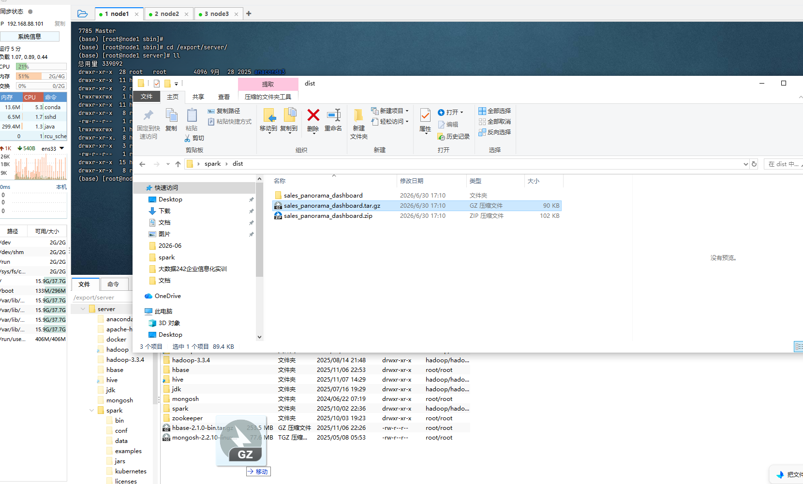
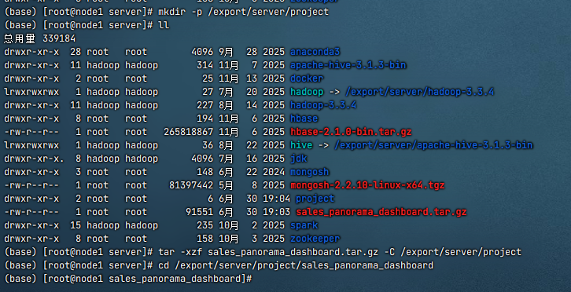
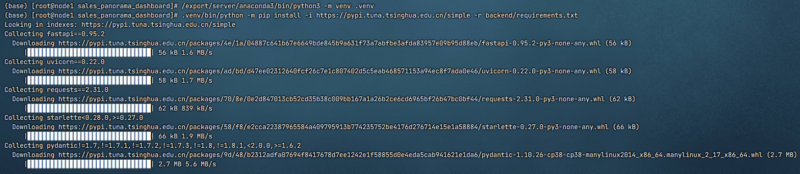
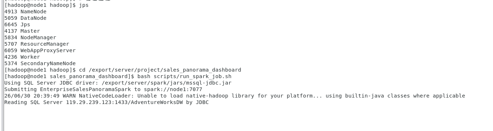
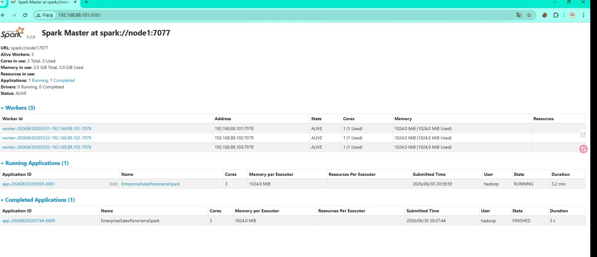
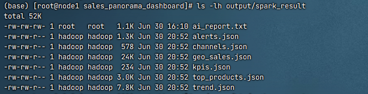
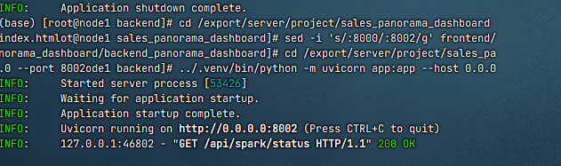
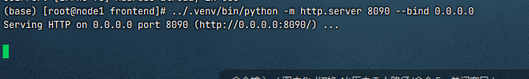

# Linux 版本上传 GitHub 与服务器部署说明

本文档用于说明两件事：

1. 如何把当前 Linux 部署版项目上传到 GitHub 仓库 `DYJ16/sales_panorama_dashboard`。
2. 如何在 Linux / CentOS7 的 node1 节点上解压并运行项目。

当前 GitHub 仓库地址：

```text
https://github.com/DYJ16/sales_panorama_dashboard
```

注意：该仓库当前远程分支是 `main`，不是 `master`。如果页面上看到默认分支是 `main`，后续命令都使用 `main`。

## 1. 本地 Linux 版本目录

当前要上传的是 Linux 部署版本目录：

```text
C:\Users\PXHONY\Desktop\spark\dist\sales_panorama_dashboard
```

这个目录是部署成品目录，里面已经包含：

```text
backend/
frontend/
docs/
output/
scripts/
README.md
run.py
```

其中：

- `scripts/start.sh`：Linux 一键启动脚本
- `scripts/run_spark_job.sh`：Spark 分布式指标计算任务
- `scripts/generate_ai_report.sh`：DeepSeek V4 报告生成脚本
- `scripts/check_spark_cluster.sh`：Spark 集群检查脚本
- `README.md`：GitHub 首页项目介绍

## 2. 推荐上传方式

不要直接在外层 `C:\Users\PXHONY\Desktop\spark` 仓库里推送，因为外层仓库当前远程是 `DYJ16/spark.git`，不是目标仓库。

推荐新建一个发布目录，把 `dist/sales_panorama_dashboard` 的内容复制进去，再推送到 `DYJ16/sales_panorama_dashboard`。

## 3. 第一次准备发布目录

在 Windows PowerShell 中执行：

```powershell
cd C:\Users\PXHONY\Desktop\spark
git clone https://github.com/DYJ16/sales_panorama_dashboard.git publish_sales_panorama_dashboard
```

进入发布目录：

```powershell
cd C:\Users\PXHONY\Desktop\spark\publish_sales_panorama_dashboard
git status
```

确认当前分支：

```powershell
git branch
```

如果显示 `main`，说明分支正确。

## 4. 同步 Linux 部署版项目到发布目录

在 PowerShell 中执行：

```powershell
robocopy C:\Users\PXHONY\Desktop\spark\dist\sales_panorama_dashboard C:\Users\PXHONY\Desktop\spark\publish_sales_panorama_dashboard /MIR /XD .git .venv __pycache__ /XF *.pyc run.log run.stdout.log run.stderr.log
```

说明：

- `/MIR` 表示镜像同步，目标目录会和源目录保持一致。
- `/XD .git` 避免覆盖 Git 仓库目录。
- `/XD .venv __pycache__` 避免上传虚拟环境和缓存。
- `/XF *.pyc run.log run.stdout.log run.stderr.log` 避免上传运行缓存日志。

同步完成后查看状态：

```powershell
cd C:\Users\PXHONY\Desktop\spark\publish_sales_panorama_dashboard
git status
```

## 5. 提交并推送到 GitHub

如果 `git status` 显示有变更，执行：

```powershell
git add .
git commit -m "Update Linux deployment version"
git push origin main
```

推送成功后打开：

```text
https://github.com/DYJ16/sales_panorama_dashboard
```

确认 GitHub 页面显示新版 `README.md`、`scripts/`、`backend/`、`frontend/` 和 `docs/`。

## 6. 如果 GitHub 需要登录

如果 `git push` 时要求登录，推荐使用 GitHub Personal Access Token。

推送时用户名填写 GitHub 用户名，密码位置填写 token。

也可以先配置 Git：

```powershell
git config --global user.name "DYJ16"
git config --global user.email "你的GitHub邮箱"
```

## 7. 服务器部署：上传压缩包

Linux 部署包位于：

```text
C:\Users\PXHONY\Desktop\spark\dist\sales_panorama_dashboard.tar.gz
```

将该文件上传到 node1 的 `/export/server/project` 目录。



如果使用 Xftp、FinalShell、MobaXterm 或其他图形工具，直接把压缩包拖到：

```text
/export/server/project
```

如果使用命令行 `scp`，示例：

```bash
scp sales_panorama_dashboard.tar.gz root@node1:/export/server/project/
```

## 8. 服务器部署：创建目录并解压



在 node1 上执行：

```bash
mkdir -p /export/server/project
tar -xzf sales_panorama_dashboard.tar.gz -C /export/server/project
cd /export/server/project/sales_panorama_dashboard
```

这一步对应截图中的核心内容：

```text
将打包好的项目上传到服务器
mkdir -p /export/server/project
tar -xzf sales_panorama_dashboard.tar.gz -C /export/server/project
cd /export/server/project/sales_panorama_dashboard
对项目进行解压
```

解压后检查目录：

```bash
ls
```

应看到：

```text
backend  frontend  docs  output  scripts  run.py  README.md
```

创建虚拟环境安装好所需的模块



## 9. 检查 Spark 集群

在 node1 上执行：



```bash
bash scripts/check_spark_cluster.sh
```

也可以打开 Spark Master UI：



```text
http://node1:8080
```

正常情况下应该能看到：

```text
node1：Spark Master + Worker
node2：Spark Worker
node3：Spark Worker
```

## 10. 运行 Spark 指标计算任务

在项目根目录执行：

```bash
cd /export/server/project/sales_panorama_dashboard
bash scripts/run_spark_job.sh
```

成功后检查输出：

```bash
ls -lh output/spark_result
```

应包含：

```text
kpis.json
trend.json
top_products.json
channels.json
geo_sales.json
alerts.json
```

这些文件是 Spark 分布式指标计算结果，前端和 DeepSeek V4 都会使用这些结果。



## 11. 启动系统

一键启动：

```bash
cd /export/server/project/sales_panorama_dashboard
bash scripts/start.sh
```

启动脚本会完成：

```text
检查 Java / Python / Spark
创建 Python 虚拟环境
使用国内镜像安装依赖
检查 SQL Server JDBC 驱动
运行 Spark 指标计算
生成 DeepSeek V4 AI 报告
启动 FastAPI 后端
启动前端页面服务
```

前端



后端




访问系统：

```text
http://node1:8088/index.html
```

如果浏览器无法解析 `node1`，使用 node1 的 IP：

```text
http://node1的IP:8088/index.html
```

## 12. 实机操作建议

系统打开后建议按以下顺序演示：

```text
1. 查看首页标题：Spark AI 企业销售决策系统
2. 查看 KPI 总览：销售额、订单量、客户数、产品数、客单价
3. 查看销售趋势：月度销售额和订单变化
4. 查看渠道结构：Internet 与 Reseller 对比
5. 查看产品排行：Top 产品贡献
6. 查看区域销售：国家、地区、城市销售表现
7. 查看 Spark 计算层：确认数据来自 Spark 结果
8. 点击生成 AI 报告：展示 DeepSeek V4 经营诊断
```

## 13. 停止系统

```bash
cd /export/server/project/sales_panorama_dashboard
bash scripts/stop.sh
```

## 14. 常见问题

### 14.1 目标仓库不是当前远程仓库

如果在外层目录执行：

```powershell
git remote -v
```

看到的是：

```text
https://github.com/DYJ16/spark.git
```

说明当前目录不是 `sales_panorama_dashboard` 仓库。请使用本文第 3 节的方式单独 clone 目标仓库后再同步。

### 14.2 GitHub 默认分支不是 master

当前远程仓库分支是：

```text
main
```

所以推送命令应使用：

```powershell
git push origin main
```

不要使用：

```powershell
git push origin master
```

除非你已经在 GitHub 上创建了 `master` 分支。

### 14.3 解压后目录不对

如果执行：

```bash
cd /export/server/project/sales_panorama_dashboard
```

提示目录不存在，检查实际解压结果：

```bash
ls -lh /export/server/project
```

确认压缩包解出来的目录名称是否为 `sales_panorama_dashboard`。

### 14.4 前端无法访问

检查前端端口：

```bash
ss -lntp | grep 8088
```

检查日志：

```bash
tail -f output/logs/frontend.log
```

### 14.5 后端无法访问

检查后端端口：

```bash
ss -lntp | grep 8000
```

检查日志：

```bash
tail -f output/logs/backend.log
```

## 15. 总结

上传 GitHub 时，上传的是：

```text
C:\Users\PXHONY\Desktop\spark\dist\sales_panorama_dashboard
```

服务器部署时，上传的是：

```text
C:\Users\PXHONY\Desktop\spark\dist\sales_panorama_dashboard.tar.gz
```

服务器解压和运行核心命令：

```bash
mkdir -p /export/server/project
tar -xzf sales_panorama_dashboard.tar.gz -C /export/server/project
cd /export/server/project/sales_panorama_dashboard
bash scripts/start.sh
```
